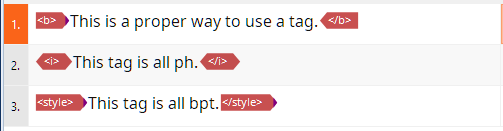
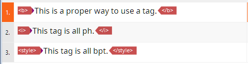
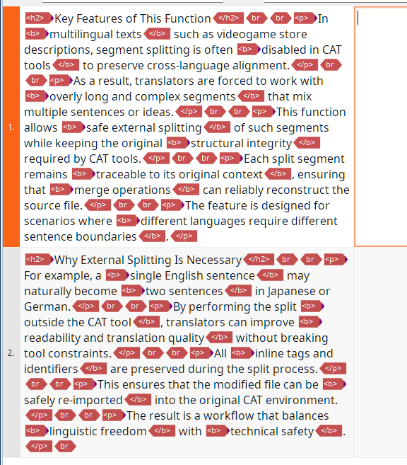
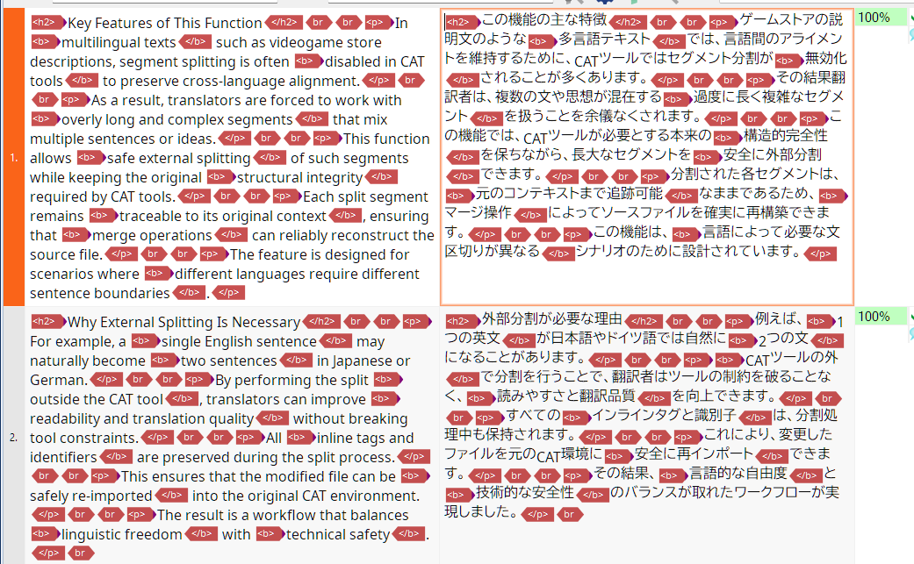

# xliffkit

xliffkit is a Python library designed to safely handle XLIFF produced by CAT tools in practical workflows.

Although the project is named "xliffkit", its scope is intentionally limited to mqXLIFF.

Support for the entire XLIFF standard or dialects from other tools (e.g. Trados) is out of scope; such support should be added as separate dialect modules when needed.

## Purpose

- Convert CAT-origin XLIFF into an intermediate representation that is easy to process programmatically.
- Normalize tags and segment structure to remove visual or structural inconsistencies.
- Apply rule-based splitting and merging of segments to correct inappropriate segmentation.
- Provide a pure library (no CLI or application dependencies) suitable for embedding into pipelines.

This library is not a translation tool. It is a toolbox for safely manipulating XLIFF files.

## Supported Formats

- Supported: memoQ-generated XLIFF (mqXLIFF)
- Not supported:
  - Trados-origin XLIFF
  - Full generic XLIFF support
  - Complete coverage of the XLIFF specification

mqXLIFF-specific quirks and rules are isolated under `dialects/mqxliff.py`.

## Design Principles

- The library is stateless by design.
- Configuration, logging, and CLI concerns are the responsibility of the caller.
- Direct manipulation of XLIFF XML is minimized.
- All processing flows through the project's intermediate models (`core.models`).

## Repository Layout

```
xliffkit/
├─ core/          # parser / serializer / core models
├─ dialects/      # mqXLIFF-specific rules and isolation
├─ io/            # YAML and other I/O helpers
├─ normalize/     # tag and text normalization utilities
├─ segment/       # split / merge logic
├─ utils/
└─ exceptions.py
```

## Main Features

See the [examples](docs/examples.md) for usage.

### 1. Tag normalization

* Fix low-visibility inline tags into consistent structures (for example, converting `ph`-wrapped `b`/`i` back into `bpt`/`ept`).
* The aim is structural normalization without changing the semantic content.

<div style="display:flex; gap:1rem; align-items:flex-start;">
  <div style="flex:1; display:flex; flex-direction:column; align-items:center; gap:0.5rem;">
  <b style="margin:0; padding:0; align-self:center;">Before</b>
  
  </div>
  <div style="flex:1; display:flex; flex-direction:column; align-items:center; gap:0.5rem;">
  <b style="margin:0; padding:0; align-self:center;">After</b>
  
  </div>
</div>

### 2. Segment splitting

* Rule-based sentence splitting using regular expressions.
* Splitting rules can be provided externally (dictionary/YAML).
* Splitting does not perform automatic merging.

<div style="display:flex; gap:1rem; align-items:flex-start;">
  <div style="flex:1; display:flex; flex-direction:column; align-items:center; gap:0.5rem;">
  <b style="margin:0; padding:0; align-self:center;">Before</b>
  
  </div>
  <div style="flex:1; display:flex; flex-direction:column; align-items:center; gap:0.5rem;">
  <b style="margin:0; padding:0; align-self:center;">After</b>
  
  </div>
</div>

### 3. Segment merging

* Merge split segments using strategy-driven rules.
* Splitting and merging are always separate operations.

<div style="display:flex; gap:1rem; align-items:flex-start;">
  <div style="flex:1; display:flex; flex-direction:column; align-items:center; gap:0.5rem;">
  <b style="margin:0; padding:0; align-self:center;">Before</b>
  
  </div>
  <div style="flex:1; display:flex; flex-direction:column; align-items:center; gap:0.5rem;">
  <b style="margin:0; padding:0; align-self:center;">After</b>
  
  </div>
</div>

## Out of Scope

* Providing a CLI
* Managing configuration files
* Handling logging setup
* Performing translation or quality assurance logic

These responsibilities belong to higher-level projects that embed this library.

## Intended Users

* Translation pipelines
* One-off scripts and tooling

The library's responsibility is to "safely transform XLIFF" regardless of the calling context.

## Notes

This library is designed for practical, production usage. It prioritizes:

* robustness (avoid breaking files)
* predictability
* traceable, minimal diffs

## Known Issues

When merging segments, if the number of tags differs between the source and target, the target's tag representation is flattened after merging.

## License

MIT License
