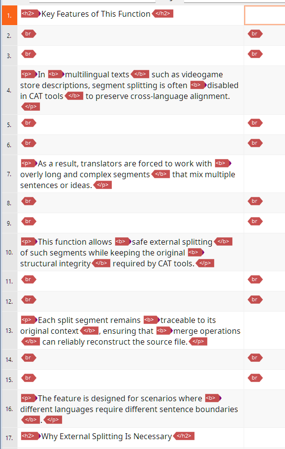
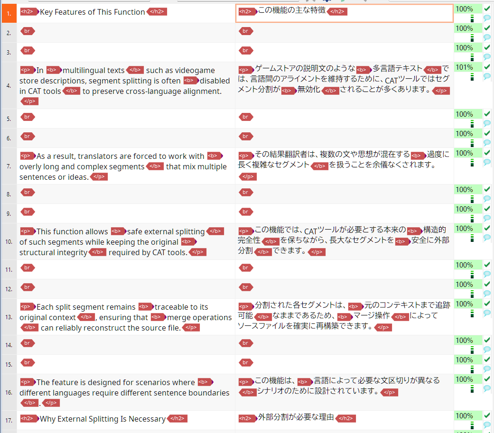

# Examples

This page shows concise before/after snapshots for the sample projects in the repository's `examples/` directory.
Each example focuses on "what changes" and intentionally omits detailed CLI or step-by-step instructions.

## 01_fix_ph_to_bpt_ept

- Description: Convert anonymous `ph` tags that wrap formatting (e.g. bold/italic) into structured start/end tags such as `bpt`/`ept`.
- Expected benefit: Restored structure improves portability for serializers and translation tools.
- Directory: [examples/01_fix_ph_to_bpt_ept](../../examples/01_fix_ph_to_bpt_ept)

  

  <b style="margin:0; padding:0; align-self:center;">Before</b>
  
  

  

  <b style="margin:0; padding:0; align-self:center;">After</b>
  
  

## 02_split

- Description: Split long segments at sentence boundaries while preserving inline tag integrity, producing multiple TUs suitable for sentence-level editing.
- Expected benefit: More uniform translation units; may improve matches against translation memory.
- Directory: [examples/02_split](../../examples/02_split)

  

  <b style="margin:0; padding:0; align-self:center;">Before</b>
  
  

  

  <b style="margin:0; padding:0; align-self:center;">After</b>
  
  

## 03_merge

- Description: Recombine multiple split TUs based on context ID, renumber tag IDs and adjust flattened representations to restore the original grouping.
- Expected benefit: Produce consistent TUs after a split→edit→merge workflow.
- Directory: [examples/03_merge](../../examples/03_merge)

  

  <b style="margin:0; padding:0; align-self:center;">Before</b>
  
  

  

  <b style="margin:0; padding:0; align-self:center;">After</b>
  
  

